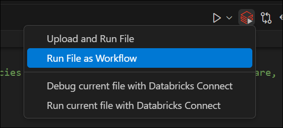
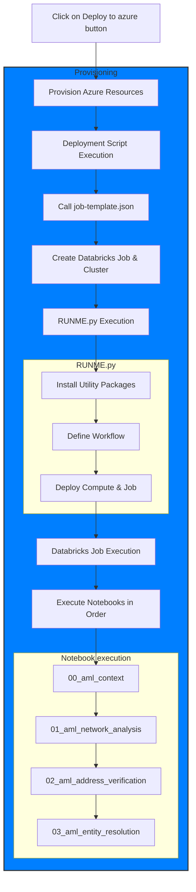

*Anti-Money Laundering (AML) compliance has been undoubtedly one of the top regulatory agenda items in the United States and across the globe to provide oversight of financial institutions. Given the shift to digital banking, Financial Institutions process billions of transactions every day and the scope for money laundering grows every day even with stricter payment monitoring and robust Know Your Customer (KYC) solutions. In this solution, we would like to share our experiences working with our customers on how FSI can build an Enterprise-scale AML solution on a Lakehouse platform that not only provides strong oversight but also provides innovative solutions to scale and adapt to the reality of modern ways of online money laundering threats. Through the concept of graph analytics, natural language processing (NLP) as well as computer vision, we will be uncovering multiple aspects of AML prevention in a world of Data and AI.*

---
<anindita.mahapatra@databricks.com>, <ricardo.portilla@databricks.com>, <sri.ghattamaneni@databricks.com>

To run this accelerator, clone this repo into a Databricks workspace. Attach the RUNME notebook to any cluster running a DBR 11.0 or later runtime, and execute the notebook via Run-All. A multi-step-job describing the accelerator pipeline will be created, and the link will be provided. Execute the multi-step-job to see how the pipeline runs.

The job configuration is written in the RUNME notebook in json format. The cost associated with running the accelerator is the user's responsibility.

## How to run locally

1. Install the "[Databricks](https://marketplace.visualstudio.com/items?itemName=databricks.databricks)" extension.
1. Create in the azure portal an instance of Databricks Service
1. [Follow these steps](https://docs.databricks.com/en/dev-tools/vscode-ext/configure.html) to configure the extension with the new Databricks Service in azure
1. Use the "run file as workflow" button to run the notebook you want to test locally

## Notebooks summary

### 00 Aml context
This notebook provides an overview of Databricks' AML solution, outlining the use of graph analytics, NLP, and computer vision for fraud detection. It includes references to required libraries, licensing details, and links to the full solution. This serves as a starting point for configuring the AML environment before running analytical workflows.

### 01 Aml network analysis
This notebook performs network analysis for Anti-Money Laundering (AML) using GraphFrames in Databricks. It builds transaction graphs, detects synthetic identities, identifies suspicious transaction patterns (structuring, round-tripping), and propagates risk scores across the network. Outputs include detected fraud patterns, entity risk scores, and structured datasets for further SQL-based analysis.

### 02 Aml Address Validation

This notebook automates address validation for AML investigations by matching textual addresses with street view images using Google Maps API and a pre-trained VGG16 model. It classifies images to verify property legitimacy, storing results in Delta Lake for easy querying and analysis. This approach accelerates manual validation processes, enabling faster and more efficient AML workflows.

### 03 Aml entity resolution

This notebook focuses on entity resolution and data deduplication for AML investigations using the Splink library. It identifies duplicate records by matching entity attributes like organization names, addresses, and transaction amounts, assigning match probabilities to flag potential inconsistencies. The results are stored in Delta Lake, enabling efficient querying and analysis for AML workflows.

## Permissions requirements
The user need to have the following permissions for the deployment to succeed ([link](https://learn.microsoft.com/en-us/azure/databricks/getting-started/free-trial#permissions)):
- Azure Contributor or Owner role at the subscription level
- A custom role definition that has the following list of permissions:
  - Microsoft.Databricks/workspaces/*
  - Microsoft.Resources/subscriptions/resourceGroups/read
  - Microsoft.Resources/subscriptions/resourceGroups/write
  - Microsoft.Databricks/accessConnectors/*
  - Microsoft.Compute/register/action
  - Microsoft.ManagedIdentity/register/action
  - Microsoft.Storage/register/action
  - Microsoft.Network/register/action
  - Microsoft.Resources/deployments/validate/action
  - Microsoft.Resources/deployments/write
  - Microsoft.Resources/deployments/read

## Flow chart diagram
This flow chart details the execution order when deploying using the "Deploy to azure" button.

&copy; 2021 Databricks, Inc. All rights reserved. The source in this notebook is provided subject to the Databricks License [https://databricks.com/db-license-source].  All included or referenced third party libraries are subject to the licenses set forth below.

| library                                | description             | license    | source                                              |
|----------------------------------------|-------------------------|------------|-----------------------------------------------------|
| graphframes:graphframes                | Graph library           | Apache2    | https://github.com/graphframes/graphframes          |
| torch                                  | Pytorch library         | BSD        | https://pytorch.org/                                |
| Pillow                                 | Image processing        | HPND       | https://python-pillow.org/                          |
| Splink                                 | Entity linkage          | MIT        | https://github.com/moj-analytical-services/splink   |